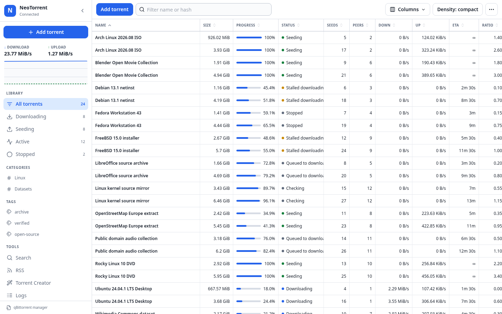
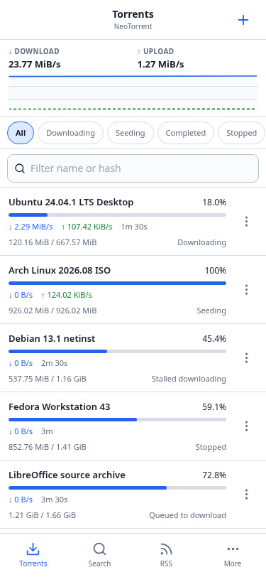

# NeoTorrent

[](https://github.com/dotSML/neotorrent/actions/workflows/ci.yml)
[](https://github.com/dotSML/neotorrent/actions/workflows/container.yml)

NeoTorrent is a responsive Vue 3 WebUI for qBittorrent. It provides a dense desktop torrent table, compact mobile views, and direct access to qBittorrent's `/api/v2` Web API.

NeoTorrent can run in either of two forms:

- a native qBittorrent Alternative WebUI with the expected `public/` and `private/` roots; or
- a standalone, same-origin Nginx container that proxies `/api/` to qBittorrent.

> [!IMPORTANT]
> NeoTorrent is an implementation preview. It is not a complete replacement for every stock qBittorrent WebUI feature. Review the [implementation status](IMPLEMENTATION_STATUS.md), [feature parity ledger](docs/feature-parity.md), and [security model](docs/security.md) before exposing it as an administrative interface.

NeoTorrent is an independent project and is not affiliated with or endorsed by the qBittorrent project.

## Screenshots





## Highlights

- Virtualized desktop and mobile torrent lists with keyboard and multi-selection support.
- Torrent addition from files, magnets, and HTTP(S) URLs.
- Optional Media Placement assistance with independent TV/Movie/Other classification and
  Suggested or first-class Manual destinations.
- Shared desktop and mobile actions for lifecycle, queue, location, limits, categories, tags, comments, and deletion.
- Overview, Files, Trackers, Peers, Web Seeds, and Pieces detail views.
- Search, RSS, Torrent Creator, logs, transfer statistics, categories, tags, and curated server settings.
- Resilient initial connection and incremental `sync/maindata` handling.
- Native Alternative WebUI packaging with relative public/private assets.
- A non-root standalone container with same-origin API proxying, health endpoints, security headers, and Kubernetes examples.
- A PWA service worker that keeps all API traffic network-only.
- Deterministic mock development through MSW.

## Compatibility

| Area            | Support                                                                 |
| --------------- | ----------------------------------------------------------------------- |
| qBittorrent     | 5.2.3 verified; 5.0 and later are best effort                           |
| Web API         | 2.15.1 verified; 2.11.2 and later use capability-aware fallbacks        |
| Browsers        | Current evergreen browsers with ES2022, modules, `fetch`, and hash URLs |
| Node.js         | 22 or later for development and builds                                  |
| Package manager | pnpm 10.15.0 through Corepack                                           |

NeoTorrent uses qBittorrent 5's `torrents/start` and `torrents/stop` routes and does not fall back to the older pause/resume route names. Version-dependent behavior is documented in [docs/api-capabilities.md](docs/api-capabilities.md).

## Try it with mock data

No qBittorrent process is required for mock mode.

```bash
corepack pnpm install --frozen-lockfile
corepack pnpm dev:mock
```

Open the URL printed by Vite. Mock mode serves deterministic qBittorrent-shaped responses for authentication, live torrent data, details, search, RSS, Torrent Creator, logs, settings, and client data. MSW is excluded from production builds.

## Develop against qBittorrent

Copy the example environment file and set the local qBittorrent origin:

```bash
cp .env.example .env.local
corepack pnpm dev
```

For example:

```dotenv
VITE_QBITTORRENT_URL=http://127.0.0.1:8080
```

Use only an origin. Do not include credentials, cookies, public hostnames, API keys, query strings, or fragments, and do not commit `.env.local`. Vite proxies `/api` during development; production requests remain same-origin and relative to the page.

## Build and install

### Native Alternative WebUI

Build the package:

```bash
corepack pnpm build:alt-webui
```

The build creates:

- `dist/alt-webui/`, containing the complete Alternative WebUI directory; and
- `dist/qbittorrent-modern-webui.zip`, containing the same `public/` and `private/` roots.

Point qBittorrent's **Alternative WebUI files location** at the parent `dist/alt-webui/` directory, not either child directory. Keep a tested recovery path to the desktop UI or qBittorrent configuration before changing Web UI settings.

### Standalone container

Build a local image from the checked-out revision:

```bash
NEOTORRENT_IMAGE=neotorrent:local corepack pnpm container:build
```

`QBITTORRENT_URL` must be the qBittorrent base HTTP(S) URL without credentials, query text, fragments, or `/api/v2`. The image listens on port `8081`, runs as UID/GID `101:101`, and supports a read-only root filesystem with `/tmp` writable.

Media Placement defaults to off for compatibility. Standalone deployments can enable it with
`NEOTORRENT_MEDIA_MODE=assist` and qBittorrent-visible `NEOTORRENT_TV_ROOT`,
`NEOTORRENT_MOVIES_ROOT`, and `NEOTORRENT_MEDIA_BROWSE_ROOT` values. These paths belong to the
qBittorrent host/container; NeoTorrent does not mount the media filesystem. See the
[Media Placement guide](docs/media-placement.md) for all variables, warnings, and Manual-path
behavior.

The container workflow publishes `edge`, commit-derived, and version-derived tags after its verification gates pass. For deployments, select and verify an immutable image digest rather than relying on a mutable tag.

The Kubernetes examples intentionally contain this non-runnable placeholder:

```text
ghcr.io/dotsml/neotorrent@sha256:REPLACE_WITH_PUBLISHED_DIGEST
```

Replace the entire placeholder with a reviewed digest. See [docs/deployment.md](docs/deployment.md) for container, proxy, subpath, sidecar, separate-Deployment, upgrade, and rollback guidance.

## Development commands

After `corepack enable`, you can omit the `corepack` prefix if `pnpm` is available on `PATH`.

```bash
corepack pnpm dev              # develop against qBittorrent
corepack pnpm dev:mock         # develop with deterministic mock data
corepack pnpm format:check     # check Prettier formatting
corepack pnpm lint             # run ESLint with zero warnings
corepack pnpm typecheck        # run the strict Vue/TypeScript check
corepack pnpm test             # run unit tests
corepack pnpm test:component   # run Vue component tests
corepack pnpm test:all         # run all Vitest projects
corepack pnpm test:e2e         # run Playwright browser tests
corepack pnpm build            # build the standalone frontend
corepack pnpm build:alt-webui  # build the Alternative WebUI package
corepack pnpm container:build  # build the standalone image
corepack pnpm container:test   # run proxy and qBittorrent integration tests
```

Playwright may require a one-time browser install:

```bash
corepack pnpm exec playwright install chromium webkit
```

On Linux, browser system dependencies may require `playwright install --with-deps`. Building the Alternative WebUI zip also requires `zip` on `PATH`.

## Architecture and security

All deployment modes use one typed qBittorrent API facade. A shared HTTP core resolves `api/v2/` from `document.baseURI`, sends browser-managed cookies, normalizes response and error handling, and keeps API requests out of service-worker caches. After authentication, NeoTorrent detects application and Web API versions, builds a capability registry, and starts a non-overlapping `sync/maindata` loop.

NeoTorrent is a privileged administrative client. Anyone with access to an authenticated session can perform consequential qBittorrent operations. Use HTTPS, restrict network access, and retain qBittorrent's authentication, CSRF, clickjacking, Host-header, cookie, and reverse-proxy protections.

Read [docs/architecture.md](docs/architecture.md) for design details and [docs/security.md](docs/security.md) for the threat model and deployment controls. Report vulnerabilities according to [SECURITY.md](SECURITY.md); do not disclose credentials, private torrent data, session cookies, or vulnerable deployments in a public issue.

## Project documentation

- [Implementation status and roadmap](IMPLEMENTATION_STATUS.md)
- [Product specification](docs/product-spec.md)
- [Architecture](docs/architecture.md)
- [Media Placement](docs/media-placement.md)
- [API capabilities](docs/api-capabilities.md)
- [Deployment guide](docs/deployment.md)
- [Security model](docs/security.md)
- [Feature parity ledger](docs/feature-parity.md)
- [Competitor analysis and design decisions](docs/competitor-analysis.md)

## Contributing and support

Contributions are welcome. Read [CONTRIBUTING.md](CONTRIBUTING.md) and the [Code of Conduct](CODE_OF_CONDUCT.md) before participating. Use [GitHub Issues](https://github.com/dotSML/neotorrent/issues) for reproducible bugs and scoped feature proposals, after checking for an existing report.

Include the NeoTorrent revision, qBittorrent and Web API versions, deployment mode, browser, and a sanitized reproduction. General qBittorrent configuration or daemon issues belong in qBittorrent's own support channels.

## License

This repository does not currently include a license. Until the project owner adds one, the source is publicly visible but is not distributed under an open-source license. Do not assume permission to copy, modify, or redistribute it.
