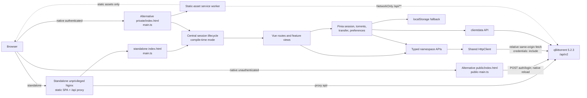

# Architecture

## Scope and status

NeoTorrent is a client-only Vue application with two production delivery modes. qBittorrent can serve separate public/private Alternative WebUI resources, or an unprivileged Nginx container can serve one standalone SPA and reverse-proxy `/api/` to qBittorrent. The Nginx layer is transport/static delivery, not a custom application API, preference sidecar, or database. Both modes are designed around qBittorrent 5.2.3 / Web API 2.15.1, same-origin browser cookies, relative URLs, and incremental state.

This document describes the code that exists. Items under **Current gaps** are intentional disclosures, not future behavior presented as complete.

## System view



The build injects a typed deployment mode; the browser does not infer it from URLs or runtime failures. In native Alternative WebUI mode, qBittorrent owns the resource boundary and successful login/logout/expiry reload so it can choose `public/` or `private/`. In standalone mode, one document probes the protected API and routes between login and the private shell in place. Mock mode uses the same in-place lifecycle with MSW.

## Source organization

```text
src/
├── api/
│   ├── core/            transport, URL resolution, parsing, errors
│   ├── capabilities/    version parsing and centralized feature thresholds
│   ├── types/           raw API/domain interfaces and initial Zod schemas
│   └── <namespace>/     auth, app, sync, transfer, torrents, search,
│                       RSS, creator, logs, client data
├── app/
│   ├── layouts/         desktop/tablet/mobile shell
│   ├── providers/       injected API key
│   ├── router/          lazy feature routes with hash history
│   └── session/         centralized mode-aware session lifecycle
├── config/              compile-time deployment-mode contract
├── domains/             torrent filters/state, file tree, graph buffer
├── features/            route and workflow components
├── stores/              session, torrent sync, transfer graph, preferences,
│                       notifications
├── ui/                  dialog and shared presentational primitives
├── utils/               formatting, URL checks, RSS sanitization
├── mocks/               MSW handlers and deterministic fixtures
├── main.ts              authenticated entry
└── public-main.ts       public login entry

container/               entrypoint, Nginx templates, deterministic and real-qB tests
deploy/kubernetes/       sidecar and separate-Deployment Kustomize examples
```

The important dependency rule is that views and stores call namespace APIs, namespace APIs call the shared HTTP core, and endpoint encoding does not live in Vue components.

## Boot and authentication sequence

`src/config/deployment.ts` defines `alternative-public`, `alternative-private`, `standalone`, and `mock`. Vite injects one exact value; unsupported modes fail the build configuration rather than falling through to an inferred production behavior.

### Standalone and mock entry

1. Nginx or Vite serves `index.html`; `main.ts` creates Vue, Router, i18n, Pinia, and the API facade.
2. `SessionLifecycle.initialize()` preserves the requested hash route and calls `session.detect()`.
3. Detection requests application version, Web API version, and build information in parallel with authentication-expiry notification suppressed for those probes.
4. A 401/403 probe result shows `/login` in the same document; a network failure shows the disconnected retry state.
5. `LoginView` posts URL-encoded credentials. qBittorrent 5.0-style HTTP-200 `Fails.` text is converted into an authentication error rather than accepted as success.
6. After login, protected probes must succeed before preferences/sync start; the intended route is then restored without reload.
7. Logout and eligible expiry clear private stores and route to login in place.

### Native Alternative WebUI entries

1. qBittorrent serves `public/index.html`; `public-main.ts` creates the minimal login application.
2. Successful login reloads so qBittorrent can select its authenticated tree.
3. qBittorrent serves `private/index.html`; `main.ts` creates the full application and runs the same protected detection/preferences/sync activation.
4. Logout and expiry clear in-memory state and reload to qBittorrent's public boundary.

In all modes, successful protected requests also act as authentication-bypass detection; there is no invented “who am I” endpoint. The application never reads or writes qBittorrent's cookie. `fetch` uses `credentials: 'include'`, leaving cookie scope, flags, expiry, and replacement to qBittorrent and the browser.

### Expiry and connection failures

The HTTP client invokes an authentication-expired callback for 401 responses and eligible 403 responses. Login and startup probes suppress that callback, and recognized Host, Origin, Referer, and CSRF response text remains a forbidden/request-validation error instead of forcing a login transition. The central lifecycle clears torrent state and preserves a safe intended route, then routes in place for standalone/mock or reloads for a native Alternative WebUI boundary. Recoverable initial network/502/503/504 failures keep the disconnected screen and retry without reload at 1, 2, 4, 8, then 15 seconds, with one detection flight and timer cleanup. The independent live-sync loop preserves the last good state, applies exponential retry delay up to 30 seconds, and offers an explicit full-resync action.

Current limitation: request-validation detection is a bounded text-marker heuristic. A differently worded qBittorrent/proxy 403 can still be classified as expiry, while all 401 responses remain authentication failures.

## HTTP and API layer

`src/api/core/httpClient.ts` is the only transport implementation. It provides:

- A base resolved from `new URL('api/v2/', document.baseURI)`.
- Query encoding through `URLSearchParams`.
- `application/x-www-form-urlencoded` POST bodies for ordinary API forms.
- Native `FormData` without manually setting its multipart boundary.
- JSON, text, empty, blob, and content-type-driven response parsing.
- Successful 200, 202, and 204 defaults with endpoint overrides available.
- Abort signal composition and a 15-second default timeout.
- `credentials: 'include'`, `cache: 'no-store'`, and `X-Requested-With`.
- Typed `ApiError` categories and bounded human-readable response detail.

The top-level facade is composition, not a monolith:

```ts
const api = {
  auth,
  app,
  sync,
  transfer,
  torrents,
  collections,
  search,
  rss,
  logs,
  clientData,
  torrentCreator
}
```

Detailed route coverage is in [api-capabilities.md](api-capabilities.md).

Most form values remain canonical until `HttpClient` applies `URLSearchParams`. Web Seed mutations are the narrow target-specific exception: after normal form decoding, qBittorrent 5.2.3 applies `QUrl::fromPercentEncoding()` again. The torrent API canonicalizes each Web Seed URL and protects only an existing `%HH` sequence as `%25HH` before the shared form encoder. It deliberately does not blanket-encode the URL, so `:`, `/`, `?`, `&`, and `=` retain their semantics. Unit contracts cover exact queries and already-encoded values; the real 5.2.3 suite covers add/list/edit/remove preservation.

Runtime validation is currently incomplete. Zod and initial schemas exist, but endpoint modules generally rely on TypeScript assertions after JSON parsing and do not yet pass those schemas to `HttpClient.request`. Version-variable and security-relevant response boundaries still need targeted validation.

## Capability model

Components should ask one centralized `CapabilityRegistry` rather than compare version strings. The registry uses parsed semantic version tuples and records minimum application/API versions for client data, detailed add results, metadata preview, piece availability, peer hostnames, category share limits, tracker tiers, web-seed management, Torrent Creator, API keys, RSS smart filtering, process information, torrent share-limit actions, torrent comments, and torrent export.

This is a positive threshold model: malformed or older versions return unavailable. It is not endpoint probing. Capability use is currently partial; Pieces, Web Seeds, process uptime, and client-data persistence are gated, while several secondary features and settings still need registry integration.

## Synchronization and domain state

The torrent store keeps shallow normalized collections:

- `Map<string, TorrentInfo>` keyed by torrent hash.
- `Map<string, Category>` keyed by category name.
- `Set<string>` for tags.
- `Map<string, string[]>` for tracker membership.
- A separate selected-hash set.

The polling loop has one in-flight `sync/maindata` request at a time. A full response builds new normalized maps. A delta shallow-copies the torrent map, replaces only changed torrent objects, preserves untouched object identities, adds complete new torrents, removes hashes/selections, and copy-on-changes category/tag/tracker collections only when their fields are present. The response ID advances after the complete synchronous apply. An incomplete new torrent causes the next request to restart from response ID zero.

The loop:

1. Polls at the configured 1, 2, or 5 second interval.
2. Uses 15 seconds while the document is hidden.
3. Aborts obsolete requests during a full resync or stop.
4. Preserves the last good collection during failure.
5. Increases retry delay exponentially, capped at 30 seconds.
6. Performs a full resync when the document becomes visible.

Filtered arrays are derived separately from stored objects, and transfer graph samples live in another store. This prevents a graph tick from replacing the entire torrent collection.

Atomicity is pragmatic rather than transactional: collection mutations occur synchronously inside one store method, but an exception after earlier mutations could leave a partially applied delta. A future hardening pass should validate and stage the complete update before committing it.

## Rendering strategy

### Torrent workspace

- TanStack Table owns desktop column definitions, sorting, visibility, and resize state.
- TanStack Virtual renders only visible desktop torrent rows.
- Column visibility, order, and widths are stored in the strict interface-preference schema; widths persist after pointer or keyboard resize.
- Stable table row IDs are torrent hashes.
- Desktop selection supports single, modifier toggle, anchored shift range, roving-tabindex Arrow navigation across virtual render boundaries through `scrollToIndex`, select all, filter focus, Escape, and Delete confirmation.
- Right-click and keyboard context invocation open an accessible action menu; phone overflow opens the corresponding action sheet.
- The desktop sidebar and inspector both support bounded pointer resizing; the sidebar and table column separators also support keyboard resizing.
- A resizable right inspector loads per-torrent detail endpoints on demand.
- Mobile virtualizes purpose-built compact rows and navigates to a dedicated detail route.

The shared desktop/mobile action menu covers start, stop, details, recheck, reannounce, force start, sequential mode, first/last-piece priority, queue movement, per-torrent rate/share limits, save location, single-torrent rename/export, automatic management, super seeding, comments, category, tags, and confirmed deletion for the current selection. Peer addition and file/folder rename remain wrapper-only. At tablet widths, a persistent 64 px icon rail keeps library and secondary routes reachable while the mobile bottom navigation remains reserved for widths below 768 px.

### Files and pieces

Torrent files are cloned into component-local immutable state, converted to an aggregate folder/file tree, flattened according to expansion/search state, and virtualized. Selection uses conventional plain/modifier/anchored-range behavior; tree Arrow/Home/End keys move one roving tab stop across virtual boundaries. Folder descendants are gathered into a `Set<number>` for `torrents/filePrio`, the selector is guarded against duplicate submission and reset after each result, and successful local updates replace file objects instead of mutating props. Mobile uses adaptive 84 px rows that retain name, progress, size, and priority. A focused regression applies one priority to a 10,000-file folder, resets, then applies the same priority to a later 20-file folder. Piece state uses Canvas to avoid one DOM node per piece. The peer tab incrementally polls `sync/torrentPeers`, applies full/delta additions and removals, aborts stale requests on tab/hash changes, slows while hidden, and virtualizes adaptive desktop/mobile rows.

### Transfer graph

`TransferGraphBuffer` is a bounded ring buffer. Server-state updates append browser-local samples; the Canvas renderer downsamples to the current width. Gaps are marked after a long sample interval. The graph is explicitly session-local and never presented as daemon history.

### Secondary routes

Search, RSS, Torrent Creator, Logs, Statistics, Settings, More, and torrent details are route-level dynamic imports. Search results, RSS articles, application/peer logs, files, and peers use virtualized or bounded rendering. Smaller configuration and task collections remain direct renderings.

## Preferences

`UiPreferences` has an explicit schema version and migration function. It contains only interface state such as theme, densities, panel dimensions, visible columns, sort, graph range, units, preferred detail tab, polling interval, and confirmations.

Persistence behavior:

1. Read `clientdata/load` for `neotorrent.ui-preferences.v2` when Web API 2.13.1+ is detected.
2. Fall back to `neotorrent:ui-preferences` in local storage when unavailable or on request failure.
3. On changes, write local storage immediately and mirror to client data when supported.

Passwords, qBittorrent cookies, torrent files, and magnet history are not part of this store.

Migration constructs a fresh allow-listed object. It validates enum and boolean fields, clamps sidebar/inspector widths and column widths, filters/uniquifies known columns and sort keys, fills defaults, and drops unknown stored keys.

## Production builds and container runtime

### Native public/private packaging

`scripts/build-alt-webui.mjs` orchestrates two Vite builds:

1. `alt-public` builds `public-entry.html` and login assets.
2. `alt-private` builds `private-entry.html`, application chunks, manifest, and service worker.
3. The script stages `public/` and `private/`, renames each entry to `index.html`, and places manifest/service-worker resources in `public/`.
4. Development mock workers are removed.
5. Every file is checked for qBittorrent's 10 MiB per-file limit and production source maps are rejected.
6. HTML/CSS/JS text is checked for root- or parent-relative `src`/`href` attributes and literal hardcoded `/api/v2/` URLs.
7. `dist/alt-webui` is zipped as `dist/qbittorrent-modern-webui.zip`.

Vite uses `base: './'`, separate `login-assets/` and `app-assets/`, hashed chunks, and disabled production source maps. Artifact security considerations are covered in [security.md](security.md).

### Standalone build and proxy

`vite build --mode standalone` emits one SPA to `dist/standalone`. The Dockerfile builds that output in a Node stage and copies it into the pinned `nginxinc/nginx-unprivileged:1.30.4-alpine@sha256:45ce1e2e699234253d1def7baa96218a5d00b498d1ba0cbb1a17b6bdf73d1351` runtime. The current local amd64 image and hosted baseline amd64/arm64 images run as `101:101` and intentionally contain neither Node nor the source/test tree.

The POSIX entrypoint validates `QBITTORRENT_URL` or the `QB_HOST`/`QB_PORT` fallback, listen port, upload size, and proxy timeouts. It rejects embedded credentials, query/fragment text, unsafe characters, and an upstream ending in `/api/v2`, then renders Nginx configuration into writable `/tmp` and runs `nginx -t`.

Nginx serves the hash-routed SPA, proxies root `/api/` to the configured upstream `/api/`, forwards cookies and validation-relevant headers, disables API buffering/caching, and returns proxy statuses without substituting the SPA. `/healthz` and `/readyz` describe only the NeoTorrent process and deliberately do not probe qBittorrent.

Kubernetes has sidecar and separate-Deployment examples. The sidecar shares loopback with an operator's unchanged qBittorrent container; the separate form reaches a private qBittorrent Service. Both render with an unprivileged/read-only/capability-drop security context and a small `/tmp` `emptyDir`. Kustomize v5.8.1 render validation passed for both. A live deployment exposed the initial qBittorrent-startup 502 sequence that motivated round-2 recovery, but the repository has not recorded full admission/topology/NetworkPolicy/TLS/rollback verification. Both examples retain a non-runnable immutable-image placeholder so an operator must deliberately choose the published baseline digest or a newly published round-2 digest.

## PWA and cache boundary

The standalone and authenticated Alternative WebUI entries register the generated service worker. Workbox precaches JS, CSS, SVG, PNG, and WOFF2 application assets. HTML is not included in the configured glob. GET and POST requests whose URL path contains `/api/` use `NetworkOnly`, and all fetches from the API client also use `no-store`.

The manifest declares standalone display, generated 192×192 and 512×512 PNG icons, the local SVG source icon, and relative start/scope. File and protocol handlers are intentionally absent until the app has a safe launch-payload consumer.

The service-worker update callback presents a confirmation and activates/reloads the update when accepted. PWA behavior has not been fully verified through either deployment mode or a reverse-proxy subpath.

## Testing architecture

- Vitest `unit` project uses a Node environment.
- Vitest `component` project uses jsdom and Vue Test Utils.
- MSW provides browser development fixtures and can support deterministic component/E2E flows.
- Playwright is configured for 1440×900 desktop, 320×700, 375×812, and 430×932 phone projects, plus 768×1024 and 1024×768 tablet projects. It starts standalone-E2E and Alternative-private-E2E Vite servers so session-boundary behavior can be tested separately.
- Build scripts produce standalone and Alternative WebUI artifacts independently of test fixtures.
- Frozen pnpm 10.15.0 installation, formatting, lint, typecheck, `build`, `build:standalone`, and `build:alt-webui` passed on the current working tree. The final full Vitest run passed 24 files / 229 tests.
- A focused store test (8/8, 286 ms file total) applies a changed delta to 5,000 torrents, preserves all 4,999 untouched object references under a generous `<1,000 ms` local regression budget, then applies a separate removal delta and verifies selection cleanup/RID 43. This is not a formal benchmark.
- The full Playwright suite passed in the official 1.62.1 Noble image at digest `sha256:dcc5531e97840b9b5e794f2814476b21571c5124a3fca2267d73041f56e7580e`: 63 passed and 81 intentional project skips across Chromium, WebKit, and 320/375/430 phone projects.
- Deterministic proxy and real qBittorrent 5.2.3 suites passed on current local linux/amd64 image content ID `sha256:d3b017b11147cc2c32377b7a09aa7b96fa63295961b997984e21a2bfa0f4004e`; Trivy 0.74.0/current DB reported 0 HIGH/CRITICAL on Alpine 3.24.1. This is a local round-2 identity, not a registry reference.
- CI run #3 and Container run #1 were green for exact baseline `a266f0f339087547edaacace316a322a348f0a7c`. The latter passed amd64/arm64 scans and published public index `sha256:07d92efa9f2ff26afccc475ffaab3dccfa98cc34db824ed9743c06142e9bafed` plus attestation manifests.
- Hosted baseline evidence predates the round-2 working-tree changes. Round 2 needs a new hosted run, per-architecture scan, and digest.

Executed results and missing suites are recorded in [../IMPLEMENTATION_STATUS.md](../IMPLEMENTATION_STATUS.md); configuration files alone are not counted as passing tests.

## Architectural constraints

- No custom application server, persistence sidecar, SSR, or database; standalone Nginx is a static server/reverse proxy only.
- No cross-origin production API configuration.
- No API contract inferred from VueTorrent.
- No raw version comparisons in templates.
- No service-worker response path for authenticated API data.
- No dependency on a runtime CDN.

## Current gaps with architectural impact

- Targeted runtime schemas are defined but not wired into most requests.
- Capability checks do not yet cover every API-dependent control or settings field.
- Several lower-priority stock actions remain wrapper-only or absent, including peer addition and file/folder rename.
- Component fixtures demonstrate bounded DOM counts for 5,000 desktop/mobile torrents, a searched 10,000-file tree, a 10,000-index priority/reapply flow, and 2,000 RSS articles. Coarse local time guards are not timing, memory, or sustained-poll benchmarks; comparable large peer and Search-result fixture evidence is also absent.
- Several user-facing strings bypass Vue I18n.
- Current builds are recorded: standalone tree 780,965 bytes; Alternative WebUI tree 1,076,344 bytes; zip 384,605 bytes with SHA-256 `8a833b0af9c4a6f00eeb2f323e302ecbce879375766d7c23a6b72b643c00d862`. Final checks found no maps, MSW worker, or embedded upstream string.
- A deployable public baseline digest exists, but there is no hosted run or immutable registry reference for the current round-2 working tree.
- Real qBittorrent coverage includes safe local mutations and outage recovery, but not Search/RSS/Creator/settings/peer workflows, large libraries, full Kubernetes topology validation, outer proxy TLS, subpaths, or PWA lifecycle.
