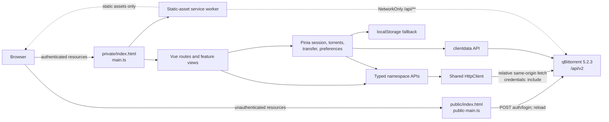

# Architecture

## Scope and status

NeoTorrent is a client-only Vue application served by qBittorrent itself in production. It has no custom API server and no database. The architecture is designed around qBittorrent 5.2.3 / Web API 2.15.1, same-origin browser cookies, relative URLs, incremental state, and separate public/private Alternative WebUI resources.

This document describes the code that exists. Items under **Current gaps** are intentional disclosures, not future behavior presented as complete.

## System view



qBittorrent owns the authentication boundary. In an installed Alternative WebUI, it serves the `public/` tree before authentication and the `private/` tree after authentication. Successful login and logout therefore reload the document instead of pretending that a client-side route changes the server's resource boundary. Mock mode keeps the transition inside the development app for testability.

## Source organization

```text
src/
├── api/
│   ├── core/            transport, URL resolution, parsing, errors
│   ├── capabilities/    version parsing and centralized feature thresholds
│   ├── types/           raw API/domain interfaces and initial Zod schemas
│   └── <namespace>/     auth, app, sync, transfer, torrents, search,
│                       RSS, creator, logs, client data
├── app/
│   ├── layouts/         desktop/tablet/mobile shell
│   ├── providers/       injected API key
│   └── router/          lazy feature routes with hash history
├── domains/             torrent filters/state, file tree, graph buffer
├── features/            route and workflow components
├── stores/              session, torrent sync, transfer graph, preferences,
│                       notifications
├── ui/                  dialog and shared presentational primitives
├── utils/               formatting, URL checks, RSS sanitization
├── mocks/               MSW handlers and deterministic fixtures
├── main.ts              authenticated entry
└── public-main.ts       public login entry
```

The important dependency rule is that views and stores call namespace APIs, namespace APIs call the shared HTTP core, and endpoint encoding does not live in Vue components.

## Boot and authentication sequence

### Public entry

1. qBittorrent serves `public/index.html`.
2. `public-main.ts` creates a minimal Vue/Pinia app and injects the API facade.
3. `LoginView` posts a URL-encoded username/password to `auth/login`.
4. The password ref is cleared on success or failure.
5. A production success reloads the document so qBittorrent can serve its authenticated resource tree.

### Private entry

1. qBittorrent serves `private/index.html`.
2. `main.ts` creates the application, router, i18n instance, Pinia, and API facade.
3. `session.detect()` requests application version, Web API version, and build information in parallel. Daemon preferences are deliberately deferred to the Settings route.
4. Successful protected requests also act as authentication-bypass detection; there is no invented “who am I” endpoint.
5. A capability registry is created from the normalized versions.
6. Interface preferences load from client data when supported, otherwise from local storage.
7. The torrent store starts `sync/maindata` polling.

The application never reads or writes qBittorrent's cookie. `fetch` uses `credentials: 'include'`, leaving cookie scope, flags, expiry, and replacement to qBittorrent and the browser.

### Expiry and connection failures

The HTTP client invokes an authentication-expired callback for 401 responses and eligible 403 responses. Login opts out of 403-as-expiry, and recognized Host, Origin, Referer, and CSRF response text remains a forbidden/request-validation error instead of forcing a login transition. The private app clears torrent state, preserves a safe intended route in memory, and reloads to the public boundary in production. Network and timeout failures instead put startup or sync into a disconnected state. The sync store preserves the last good state, applies exponential retry delay up to 30 seconds, and offers an explicit full-resync action.

Current limitation: request-validation detection is a bounded text-marker heuristic. A differently worded qBittorrent/proxy 403 can still be classified as expiry, while all 401 responses remain authentication failures.

## HTTP and API layer

`src/api/core/httpClient.ts` is the only transport implementation. It provides:

- A base resolved from `new URL('api/v2/', document.baseURI)`.
- Query encoding through `URLSearchParams`.
- `application/x-www-form-urlencoded` POST bodies for ordinary API forms.
- Native `FormData` without manually setting its multipart boundary.
- JSON, text, empty, blob, and content-type-driven response parsing.
- Successful 200, 202, and 204 defaults with endpoint overrides available.
- Abort signal composition and a 15-second default timeout.
- `credentials: 'include'`, `cache: 'no-store'`, and `X-Requested-With`.
- Typed `ApiError` categories and bounded human-readable response detail.

The top-level facade is composition, not a monolith:

```ts
const api = {
  auth,
  app,
  sync,
  transfer,
  torrents,
  collections,
  search,
  rss,
  logs,
  clientData,
  torrentCreator
}
```

Detailed route coverage is in [api-capabilities.md](api-capabilities.md).

Runtime validation is currently incomplete. Zod and initial schemas exist, but endpoint modules generally rely on TypeScript assertions after JSON parsing and do not yet pass those schemas to `HttpClient.request`. Version-variable and security-relevant response boundaries still need targeted validation.

## Capability model

Components should ask one centralized `CapabilityRegistry` rather than compare version strings. The registry uses parsed semantic version tuples and records minimum application/API versions for client data, detailed add results, metadata preview, piece availability, peer hostnames, category share limits, tracker tiers, web-seed management, Torrent Creator, API keys, RSS smart filtering, process information, and torrent export.

This is a positive threshold model: malformed or older versions return unavailable. It is not endpoint probing. Capability use is currently partial; Pieces, Web Seeds, process uptime, and client-data persistence are gated, while several secondary features and settings still need registry integration.

## Synchronization and domain state

The torrent store keeps shallow normalized collections:

- `Map<string, TorrentInfo>` keyed by torrent hash.
- `Map<string, Category>` keyed by category name.
- `Set<string>` for tags.
- `Map<string, string[]>` for tracker membership.
- A separate selected-hash set.

The polling loop has one in-flight `sync/maindata` request at a time. A full response clears and rebuilds normalized maps. A delta response mutates existing torrent objects in place, adds complete new torrents, removes hashes, and applies category/tag/tracker/server-state changes. The response ID advances after applying the response. An incomplete new torrent causes the next request to restart from response ID zero.

The loop:

1. Polls at the configured 1, 2, or 5 second interval.
2. Uses 15 seconds while the document is hidden.
3. Aborts obsolete requests during a full resync or stop.
4. Preserves the last good collection during failure.
5. Increases retry delay exponentially, capped at 30 seconds.
6. Performs a full resync when the document becomes visible.

Filtered arrays are derived separately from stored objects, and transfer graph samples live in another store. This prevents a graph tick from replacing the entire torrent collection.

Atomicity is pragmatic rather than transactional: collection mutations occur synchronously inside one store method, but an exception after earlier mutations could leave a partially applied delta. A future hardening pass should validate and stage the complete update before committing it.

## Rendering strategy

### Torrent workspace

- TanStack Table owns desktop column definitions, sorting, visibility, and resize state.
- TanStack Virtual renders only visible desktop torrent rows.
- Column visibility, order, and widths are stored in the strict interface-preference schema; widths persist after pointer or keyboard resize.
- Stable table row IDs are torrent hashes.
- Desktop selection supports single, modifier toggle, shift range, keyboard arrows, select all, filter focus, Escape, and Delete confirmation.
- Right-click and keyboard context invocation open an accessible action menu; phone overflow opens the corresponding action sheet.
- The desktop sidebar and inspector both support bounded pointer resizing; the sidebar and table column separators also support keyboard resizing.
- A resizable right inspector loads per-torrent detail endpoints on demand.
- Mobile virtualizes purpose-built compact rows and navigates to a dedicated detail route.

The action menu covers start, stop, details, recheck, reannounce, force start, sequential mode, first/last-piece priority, category, tags, and confirmed deletion for the current selection. Queue priority, per-torrent limits, location, rename, automatic management, super seeding, export, and peer addition remain wrapper-only or otherwise lack complete UI. At tablet widths, a persistent 64 px icon rail keeps library and secondary routes reachable while the mobile bottom navigation remains reserved for widths below 768 px.

### Files and pieces

Torrent files are converted to an aggregate folder/file tree, flattened according to expansion/search state, and virtualized. Folder selection expands to descendant file indexes for `torrents/filePrio`. Piece state uses Canvas to avoid one DOM node per piece. The peer tab incrementally polls `sync/torrentPeers`, applies full/delta additions and removals, aborts stale requests on tab/hash changes, slows while hidden, and virtualizes the visible peer collection.

### Transfer graph

`TransferGraphBuffer` is a bounded ring buffer. Server-state updates append browser-local samples; the Canvas renderer downsamples to the current width. Gaps are marked after a long sample interval. The graph is explicitly session-local and never presented as daemon history.

### Secondary routes

Search, RSS, Torrent Creator, Logs, Statistics, Settings, More, and torrent details are route-level dynamic imports. Search results, RSS articles, application/peer logs, files, and peers use virtualized or bounded rendering. Smaller configuration and task collections remain direct renderings.

## Preferences

`UiPreferences` has an explicit schema version and migration function. It contains only interface state such as theme, densities, panel dimensions, visible columns, sort, graph range, units, preferred detail tab, polling interval, and confirmations.

Persistence behavior:

1. Read `clientdata/load` for `neotorrent.ui-preferences.v2` when Web API 2.13.1+ is detected.
2. Fall back to `neotorrent:ui-preferences` in local storage when unavailable or on request failure.
3. On changes, write local storage immediately and mirror to client data when supported.

Passwords, qBittorrent cookies, torrent files, and magnet history are not part of this store.

Migration constructs a fresh allow-listed object. It validates enum and boolean fields, clamps sidebar/inspector widths and column widths, filters/uniquifies known columns and sort keys, fills defaults, and drops unknown stored keys.

## Public/private packaging

`scripts/build-alt-webui.mjs` orchestrates two Vite builds:

1. `alt-public` builds `public-entry.html` and login assets.
2. `alt-private` builds `private-entry.html`, application chunks, manifest, and service worker.
3. The script stages `public/` and `private/`, renames each entry to `index.html`, and places manifest/service-worker resources in `public/`.
4. Development mock workers are removed.
5. Every file is checked for qBittorrent's 10 MiB per-file limit and production source maps are rejected.
6. HTML/CSS/JS text is checked for root- or parent-relative `src`/`href` attributes and literal hardcoded `/api/v2/` URLs.
7. `dist/alt-webui` is zipped as `dist/qbittorrent-modern-webui.zip`.

Vite uses `base: './'`, separate `login-assets/` and `app-assets/`, hashed chunks, and disabled production source maps. Artifact security considerations are covered in [security.md](security.md).

## PWA and cache boundary

The authenticated entry registers the generated service worker. Workbox precaches JS, CSS, SVG, PNG, and WOFF2 application assets. HTML is not included in the configured glob. GET and POST requests whose URL path contains `/api/` use `NetworkOnly`, and all fetches from the API client also use `no-store`.

The manifest declares standalone display, generated 192×192 and 512×512 PNG icons, the local SVG source icon, and relative start/scope. File and protocol handlers are intentionally absent until the app has a safe launch-payload consumer.

The service-worker update callback presents a confirmation and activates/reloads the update when accepted. PWA behavior has not been fully verified through qBittorrent's public/private resource switch or a reverse-proxy subpath.

## Testing architecture

- Vitest `unit` project uses a Node environment.
- Vitest `component` project uses jsdom and Vue Test Utils.
- MSW provides browser development fixtures and can support deterministic component/E2E flows.
- Playwright is configured for 1440×900 desktop, 320×700, 375×812, and 430×932 phone projects, plus 768×1024 and 1024×768 tablet projects, with mock-mode Vite as its web server.
- Build scripts produce ordinary and Alternative WebUI artifacts independently of test fixtures.
- A GitHub Actions workflow installs the frozen lockfile, runs format/lint/type/Vitest/build/Playwright gates with Chromium and WebKit available, and uploads `dist/alt-webui` plus the zip. Its configuration exists, but a hosted run has not been observed in this snapshot.

Executed results and missing suites are recorded in [../IMPLEMENTATION_STATUS.md](../IMPLEMENTATION_STATUS.md); configuration files alone are not counted as passing tests.

## Architectural constraints

- No custom production server, persistence sidecar, SSR, or database.
- No cross-origin production API configuration.
- No API contract inferred from VueTorrent.
- No raw version comparisons in templates.
- No service-worker response path for authenticated API data.
- No dependency on a runtime CDN.

## Current gaps with architectural impact

- Targeted runtime schemas are defined but not wired into most requests.
- Capability checks do not yet cover every API-dependent control or settings field.
- Full stock action coverage is present in API wrappers but not in the interaction model.
- Component fixtures demonstrate bounded DOM counts for 5,000 desktop/mobile torrents, a searched 10,000-file tree, and 2,000 RSS articles, but no timing, memory, or sustained-poll benchmark is recorded. Comparable large peer and Search-result fixture evidence is also absent.
- Several user-facing strings bypass Vue I18n.
- The CI workflow is configured but has no recorded hosted run.
- The final real qBittorrent installation smoke covered the serving/auth boundary only; representative mutations, non-empty libraries, reverse-proxy, and broader session-edge verification remain separately evidenced.
